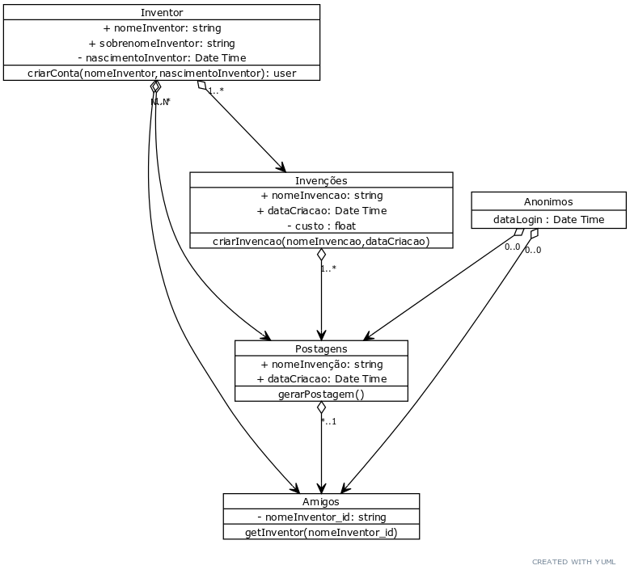
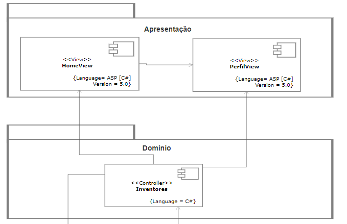
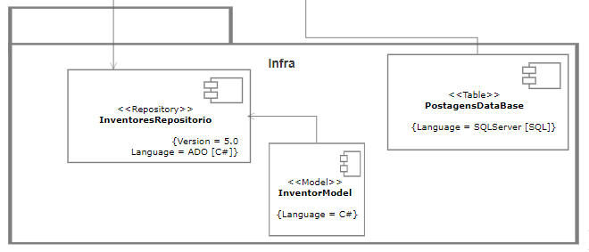


### Código do diagrama UML
````
// UML Diagram
// ------------------

// Chain elements like this
[Inventor]1..*<>>[Invenções]
[Inventor]1..*<>>[Postagens]
[Inventor]N..N<>>[Amigos]
[Postagens]*..1<>>[Amigos]
[Anonimos]0..0<>>[Postagens]
[Anonimos]0..0<>>[Amigos]
[Invenções]1..*<>>[Postagens]

// Add more detail
[Inventor|+ nomeInventor: string;+ sobrenomeInventor: string;- nascimentoInventor: Date Time|criarConta(nomeInventor,nascimentoInventor): user]

[Invenções|+ nomeInvencao: string;+ dataCriacao: Date Time;- custo : float|criarInvencao(nomeInvencao,dataCriacao)]

[Postagens|+ nomeInvenção: string;+ dataCriacao: Date Time; |gerarPostagem()]

[Amigos|- nomeInventor_id: string; |getInventor(nomeInventor_id)]

[Anonimos|dataLogin : Date Time]
````

#### Imagem do Diagrama



#### Package Diagram with base in Use Case 3 and 4


